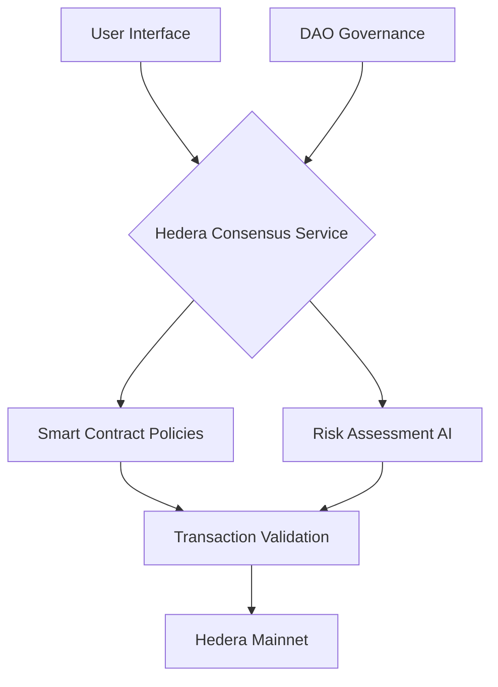
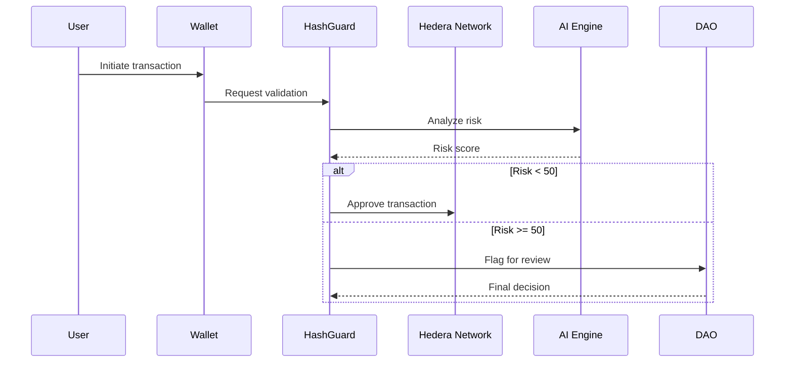

                                                                                                                                                                                                                                                                                                                        # HashGuard 🔒

[](https://hedera.com)
[](https://opensource.org/licenses/Apache-2.0)

Enterprise-grade security layer for Hedera Hashgraph networks, combining AI-powered threat detection with decentralized governance.

## Architecture Overview



## Key Features

- 🛡️ Real-time transaction monitoring
- 🧠 Machine learning threat detection
- 🗳️ DAO-driven governance model
- ⚡ Hedera-native performance (10k+ TPS)

## System Workflow



## Getting Started

### Prerequisites

- Node.js 18+
- HashPack Wallet
- Hedera Testnet Account

### Installation

```bash
git clone https://github.com/your-org/hashguard.git
cd hashguard
npm install
npm run dev
```

### Environment Setup

```env
# .env
VITE_HEDERA_NETWORK=testnet
VITE_CONTRACT_ID=0.0.1234
VITE_DAO_TOKEN=0.0.5678
```

## Contributing

1. Fork the repository
2. Create feature branch (`git checkout -b feature/amazing-feature`)
3. Commit changes (`git commit -m 'Add amazing feature'`)
4. Push to branch (`git push origin feature/amazing-feature`)
5. Open Pull Request

## License

Distributed under the Apache 2.0 License. See `LICENSE` for more information.

## Contact

Security Team - security@hashguard.io  
Project Lead - engineering@hashguard.io
